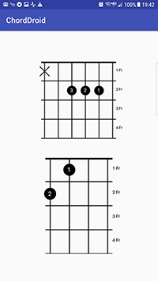

Chord Droid - Guitar and Ukulele Chord View Android
=======================================
An Android Custom Views for displaying Guitar and Ukulele Chord

Resources :
[https://github.com/wertarbyte/ChordDroid](https://github.com/wertarbyte/ChordDroid)

Screenshot
========



How to use
----------
Gradle:

```gradle
 repositories {
  jcenter()
  maven {
    url 'https://dl.bintray.com/zeattacker/maven/'
  }
}

dependencies {
  compile 'com.ramazeta:chordlib:1.0.1@aar'
}
```

Maven:

```xml
<dependency>
  <groupId>com.ramazeta</groupId>
  <artifactId>chordlib</artifactId>
  <version>1.0.1</version>
  <type>pom</type>
</dependency>
```


How to use FB Video Player
--------------------------
Detail of usage : [MainActivity.java][1].

Example :
* XML

```xml
    <com.ramazeta.chordlib.components.ChordView
        android:id="@+id/chordview"
        android:layout_width="200dp"
        android:layout_height="200dp" />

```

* JAVA

```java
        Chord chord = Chord.lookup("A");
        try {
            //initialize instrument for guitar
            instrumentGuitar = new Instrument(getAssets(), Instrument.GUITAR);

            // initialize instrument for ukulele
            instrumentUkulele = new Instrument(getAssets(), Instrument.UKULELE);
        } catch (IOException e){
            e.printStackTrace();
        }

        //Transpose
        instrumentGuitar.setTranspositionSteps(1);

        //Its have some chord variation, or you can use lookup() to get full of List<Shape>
        Shape shapeGuitar = instrumentGuitar.getShape(chord, 0);
        Shape shapeUkulele = instrumentUkulele.getShape(chord, 0);

        //set view
        chordViewGuitar.setShape(shapeGuitar);
        chordViewUkulele.setShape(shapeUkulele);


```


Updated
------
v 1.0.1 - Uploaded


Author
------
Rama Zeta - @zeattacker on GitHub, ramazeta1997@gmail.com


License
-------
```code
Copyright 2016 Rama Zeta

Licensed under the Apache License, Version 2.0 (the "License");
you may not use this file except in compliance with the License.
You may obtain a copy of the License at

http://www.apache.org/licenses/LICENSE-2.0

Unless required by applicable law or agreed to in writing, software
distributed under the License is distributed on an "AS IS" BASIS,
WITHOUT WARRANTIES OR CONDITIONS OF ANY KIND, either express or implied.
See the License for the specific language governing permissions and
limitations under the License.
```
